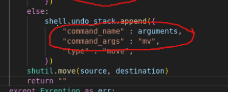
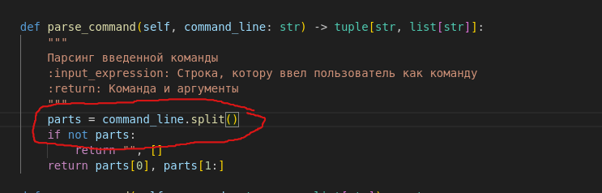
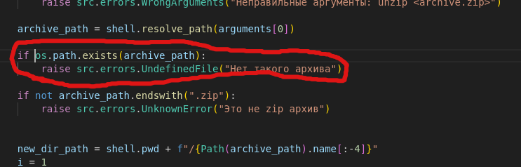
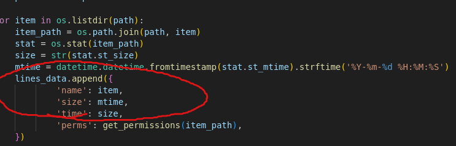
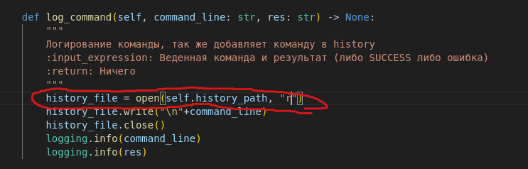

# Лабораторная работа №5

## Оганнисян Айк Арменович группа М8О-101БВ-25

## Ошибка 1 - перепутал местами аргументы (argumetns, mv) "bin/mv.py"

### Причина:
Нефиг было сидеть до 4 часов ночи писать

### Исправление:
Заменено на:

    shell.undo_stack.append({
        "command_name" : "mv",
        "command_args" : arguments,
        "type" : "move",
    })

## Ошибка 2 - явно неправильный парсинг команды с синтаксисмо как в терминале "shell.py"

### Причина:
Нефиг было сидеть до 4 часов ночи писать еще и не знать ньюансы ввода в команды в терминале

### Исправление:
Заменено на:

    parts = shlex.split(command_line.strip())

## Ошибка 3 - явно неправильное определение условия (если есть архив, то писать ошибку, что его нет) "bin/unzip.py"

### Причина:
Опять сидел до 4 часа ночи и фигню уже начал писать

### Исправление:
Заменено на:

    if not os.path.exists(archive_path):
        raise src.errors.UndefinedFile("Нет такого архива")

## Ошибка 4 - перепутал местами аргументы (mtime, size) "bin/ls.py"

### Причина:
Лучше бы пошел спать

### Исправление:
Заменено на:

    lines_data.append({
        'name': item,
        'size': size,
        'time': mtime,
        'perms': get_permissions(item_path),
    })

## Ошибка 5 - открывает файл для чтения, но потом пытается его изменять "shell.py"

### Причина:
Мне тебя жаль, лучше бы пошел поспать и матан учить, тебе экзамен сдавать :(

### Исправление:
Заменено на:

    history_file = open(self.history_path, "a")
    history_file.write("\n"+command_line)
    history_file.close()
    logging.info(command_line)
    logging.info(res)
